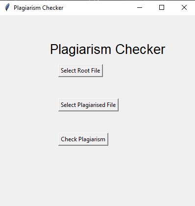
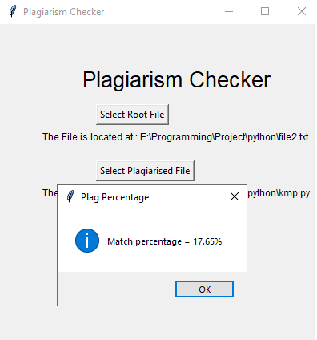

# KMP-Plagiarism-Detection
KMP (Knuth Morris Pratt) Pattern Searching Algorithm is used in various String matching applications, One of them is Plagiarism Checker.
Plagiarism Checking is used in many websites for exam and files submission.
## How does it works?
Content is first parsed into sentences and then every sentence is checked for plagiarism. If any result is found against that sentence, it will be show how much percentage of plagiarism it has.
- Take 2 Files as Input
- First the root or original file.
- Second the plagiarised file.
- After clicking on the "Check Plagiarism Button it shows the percentage of plagiarism.
# Output

# Reference
